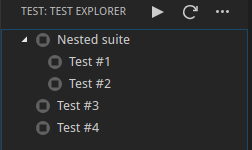

# Implementing a Test Adapter for Visual Studio Code

This repository contains an example for implementing a `TestAdapter` extension that works with the
[Test Explorer](https://marketplace.visualstudio.com/items?itemName=hbenl.vscode-test-explorer) extension.

## Setup

* install the [Test Explorer](https://marketplace.visualstudio.com/items?itemName=hbenl.vscode-test-explorer) extension
* fork and clone this repository and open it in VS Code
* run `npm install`
* run `npm run watch` or start the watch Task in VS Code
* start the debugger

You should now see a second VS Code window, the Extension Development Host.
Open a folder in this window and click the "Test" icon in the Activity bar.
Now you should see the fake example test suite in the side panel:

## Basic implementation

* add any configuration properties that your Test Adapter needs to the `contributes.configuration.properties` section of `package.json`
* replace the `loadFakeTests()` call in `src/adapter.ts` with your code for loading the test definitions for the real test framework
* replace the `runFakeTests()` call in `src/adapter.ts` with your code for running the tests in a child process using the real test framework

## Getting ready to publish

* search for all occurrences of the word "example" in this project and replace them with the name of the testing framework that your Test Adapter supports
* update `package.json` with your preferred values (at a minimum you should change `author`, `publisher`, `homepage`, `repository` and `bugs`)
* create an icon for your Test Adapter (there's an SVG version of the Test Explorer icon at `img/test-explorer.svg`) and reference it in `package.json`
* replace this README with your documentation

Now you're ready to [publish](https://code.visualstudio.com/docs/extensions/publish-extension) the first version of your Test Adapter.

## Completing the implementation

* implement the `debug()` method
* implement the `cancel()` method (it should kill the child process that was started by `run()` or `debug()`)
* watch the configuration for any changes that may affect the loading of test definitions and reload the test definitions if necessary
* watch the workspace for any changes to the test files and reload the test definitions if necessary
* watch the configuration for any changes that may affect the results of running the tests and emit an `autorun` event if necessary
* watch the workspace for any changes to the source files and emit an `autorun` event if necessary
* ensure that only one test run is active at a time
